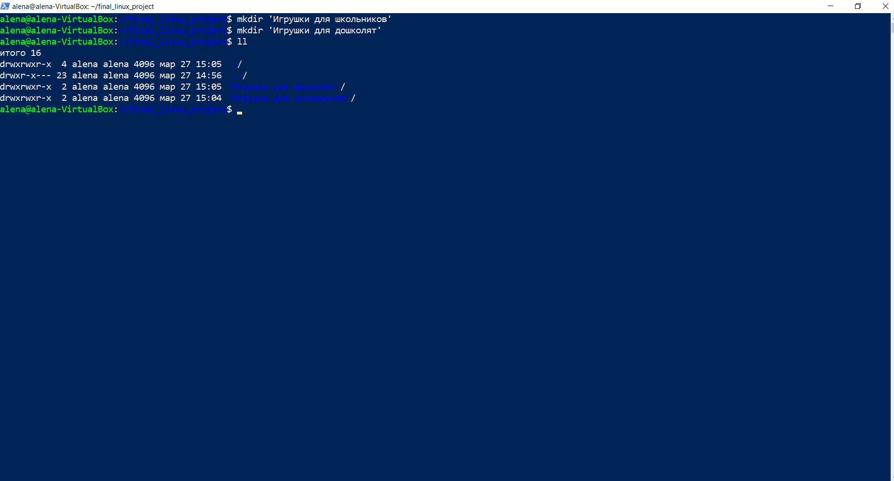
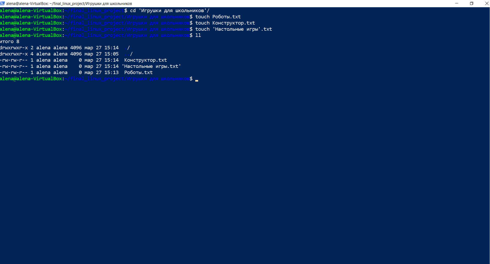
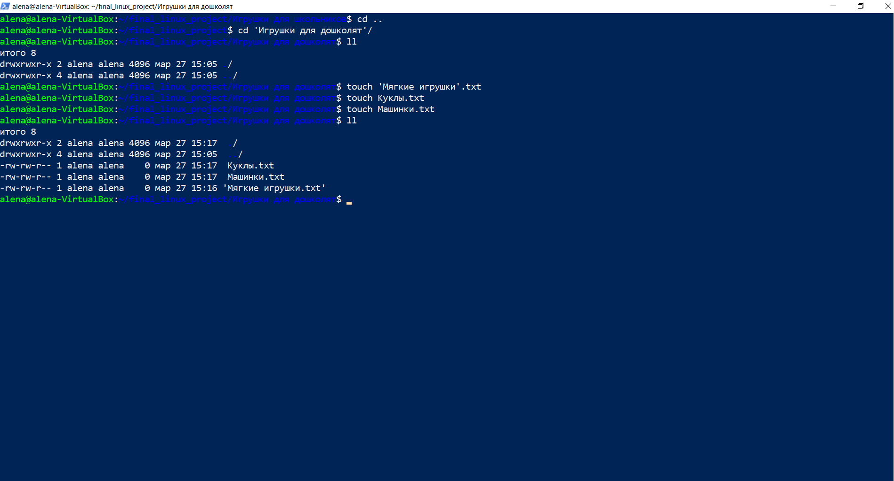
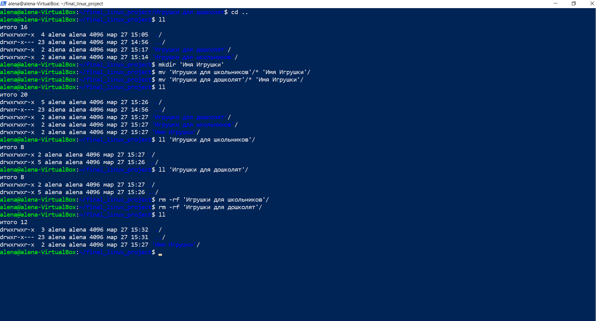
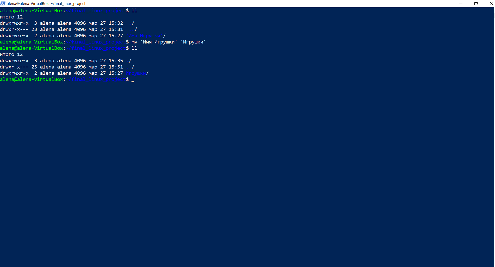
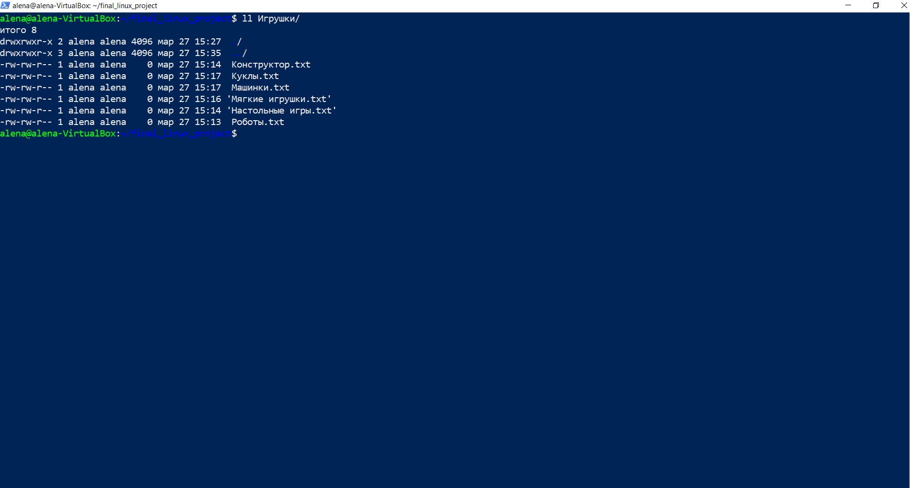
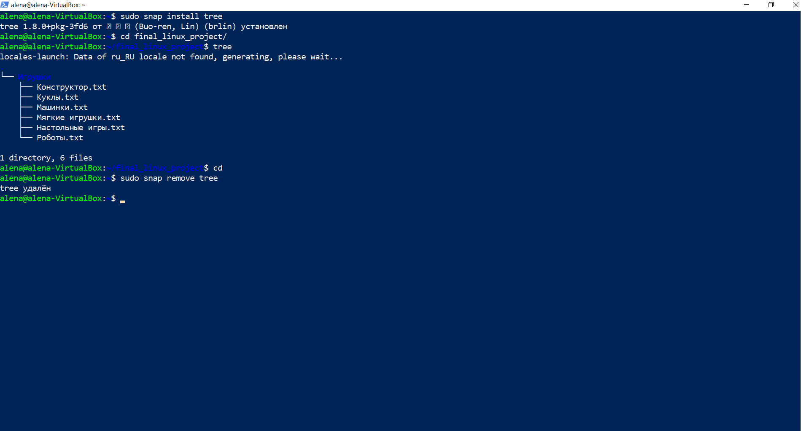
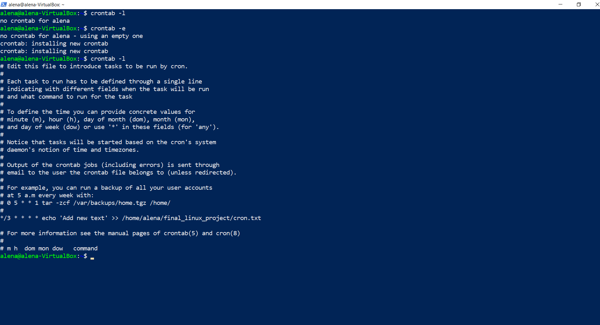

# Задание 1 – Linux
Для выполнения заданий был создан отдельный каталог с названием final_linux_project.<br>
Все команды выполнялись в Windows PowerShell по SSH-подключению.

1. Используйте команды операционной системы Linux и создайте две новых директории – «Игрушки для школьников» и «Игрушки для дошколят».

```
mkdir 'Игрушки для школьников'
mkdir 'Игрушки для дошколят'
```



***

2. Создайте в директории «Игрушки для школьников» текстовые файлы - «Роботы», «Конструктор», «Настольные игры».

```
cd 'Игрушки для школьников'/
touch Роботы.txt
touch Конструктор.txt
touch 'Настольные игры'.txt
```



***

3. Создайте в директории «Игрушки для дошколят» текстовые файлы «Мягкие игрушки», «Куклы», «Машинки».

```
cd ..
cd 'Игрушки для дошколят'/
touch 'Мягкие игрушки'.txt
touch Куклы.txt
touch Машинки.txt
```



***

4.  Объединить 2 директории в одну «Имя Игрушки».

```
cd ..
mkdir 'Имя Игрушки'
mv 'Игрушки для школьников'/* 'Имя Игрушки'/
mv 'Игрушки для дошколят'/* 'Имя Игрушки'/
rm -rf 'Игрушки для школьников'/
rm -rf 'Игрушки для дошколят'/
```



***

5. Переименовать директорию «Имя Игрушки» в «Игрушки».

```
mv 'Имя Игрушки' 'Игрушки'
```



***

6. Просмотреть содержимое каталога «Игрушки».

```
ll Игрушки/
```



***

7. Установить и удалить snap-пакет. *(Любой, какой хотите.)*

```
sudo snap install tree
sudo snap remove tree
```



***

8. Добавить произвольную задачу для выполнения каждые 3 минуты *(Например, запись в текстовый файл чего-то или копирование из каталога А в каталог Б)*.

```
crontab -e
```

Добавить в файл строку:

```
*/3 * * * * echo 'Add new text' >> /home/alena/final_linux_project/cron.txt
```



***
